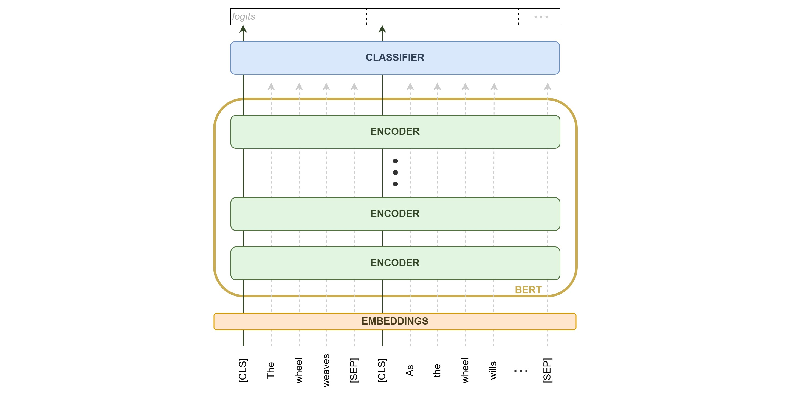

# Extractive Summarization using BERT & HuggingFace

This repository presents a fine-tuning pipeline for BERT, aiming at Extractive Summarization tasks. The original model was proposed by [Liu, 2019](https://github.com/nlpyang/BertSum) to ["Fine-Tune BERT for Extractive Summarization"](https://arxiv.org/abs/1903.10318). While [HuggingFace](https://huggingface.co/) Transformers offers an expansive library for various tasks, a comprehensive pipeline for extractive summarization is missing. 
The project also served as a tool for model interpretability using gradient-based methods from [Captum](https://github.com/pytorch/captum) and an attention-based method named [ALTI](https://github.com/mt-upc/transformer-contributions).

Additionally, I'm quite interested in the idea of highlighting text while maintaining the original content in order to improve my book summaries. You might find [kindlenotionsync](https://github.com/eReverter/kindlenotionsync) useful, as it's a handy tool for synchronizing Kindle highlights with Notion.

The architecture is the following:



## Converting Abstractive to Extractive

There is a lack of datasets available to train models for the extractive summarization task. Thus, the [`abs_to_ext.py`](abs_to_ext.py) script allows you to convert existing datasets designed for abstractive summarization tasks to a format suitable for extractive tasks. This conversion is achieved through a greedy algorithm from Liu (2019), maximizing the ROUGE score by iteratively adding sentences to the extractive summary. Alas, the extractive summaries are biased towards the first sentences of the context, but checking every possible combination is not feasible.

To convert a dataset, you can use the following command:

```bash
python abs_to_ext.py \
    -f cnn_dailymail \ # Dataset path
    -c '3.0.0' \ # Optional: Dataset version or other info
    -hf \ # Specify if the dataset is from HuggingFace hub
    -s 'article' \ # Field name for the text
    -t 'highlights' \ # Field name for the abstractive summary
    -sz 3 \ # Number of sentences desired in the extractive summary
    -m 'greedy' \ # Selection algorithm ('greedy', 'combination')
    -o data/ext_cnn_dailymail # Output path for the new DatasetDictionary
```

## Data Preparation & Training

Data preparation is carried out as proposed by Liu (2019) as well. The text is split into sentences, tokenized, and sentences that are too long (short) are trimmed (discarded). The tokenized text is then pruned to 512 tokens, which may lead to loss of information in longer examples.

The [`trainer.py`](src/trainer.py) and [`metrics.py`])(src/metrics.py) files handle the fine-tuning process, offering a simplified version of the HuggingFace pipeline. The [`run_extsum.py`](run_extsum.py) script handles data preprocessing ([`data_preparation.py`](src/data_preparation.py)) and model training. Please note, this implementation is designed for BERT and may require tweaks for other models. Run configurations are stored in [`config.json`](configs/config.json).

Use the following command to start training:

```bash
python run_extsum.py \
    -i data/ext_cnn_dailymail \ # Path to the data
    -o data/prep_ext_cnn_dailymail \ # Preprocessed data will be stored here
    -c config.json \ # Configuration file for the run
    -d checkpoints/bertsum/ # Path to save the checkpoints
```

## Evaluation

Evaluation is done using the ROUGE metric available at HuggingFace's `evaluation` library. To evaluate the model, use the [`evaluate_model.py`](evaluate_model.py) script as follows:

```bash
python evaluate_model.py \
  --model checkpoints/bertsum/bertsum \ # Path to the model checkpoint
  --dataset data/ext_cnn_dailymail \ # Dataset for evaluation
  --save_dir checkpoints/bertsum \ # Path to save ROUGE results
  --save_name results.json # Name of the results file
```

## Model Performance

The table below displays the model's performance for different seeds. The model uploaded to HuggingFace corresponds to seed 3. It's worth mentioning that the choice of the ROUGE scoring system has a notable impact on the reported results. When using plain `pyrouge`, the scores tend to be higher, which is consistent with most articles. However, when utilizing the HuggingFace scoring pipeline, the scores decrease. This difference could be attributed to variations in how the texts are tokenized behind the scenes. Nevertheless, I decided to use the HuggingFace ROUGE implementation for consistency within the same framework. I performed tests on both Liu's and my models using different scoring systems and processed extractive datasets to ensure result consistency. 

|                                   | Rouge-1 ↑ | Rouge-2 ↑ | Rouge-L ↑ |
|-----------------------------------|-----------|-----------|-----------|
| **greedy reference**              | 54.91     | 32.91     | 39.13     |
| **benchmark** (transformer encoder) | 40.67     | 19.14     | 26.67     |
| **bert-base-uncased** (linear encoder) |           |           |           |
| -- Seed(3)                        | 39.35     | 18.02     | 25.54     |
| -- Seed(4)                        | 39.32     | 17.98     | 25.48     |
| -- Seed(5)                        | 39.33     | 18.03     | 25.32     |
| **bert-base-uncased** (random weights) | 29.75     | 9.78      | 18.21     |

Table: Scores for the summarization task of each model with different initialization seeds. The best possible scores according to the greedy approach and the benchmark set by the original paper fine-tuning BERT for this task are shown, along with the scores for random weights. The ↑ symbol indicates that higher scores are better.


## Data and Weights
The extractive version of the CNN Daily Mail dataset (version 3.0.0) is available in the HuggingFace repository under [ereverter/cnn_dailymail_extractive](https://huggingface.co/datasets/ereverter/cnn_dailymail_extractive), and the fine-tuned BERT model weights can be found at [ereverter/bert-finetuned-cnn_dailymail](https://huggingface.co/ereverter/bert-finetuned-cnn_dailymail). `Datasets`, `AutoTokenizer` and `AutoModel` can be used to load all of the required pieces, but check the [`playground.ipynb`](playground.ipynb) notebook to see how to process a single sample for inference. Tokenizing the text is not enough, it requires an additional step as in the `prepare_sample` from [`utils.py`](utils.py).
